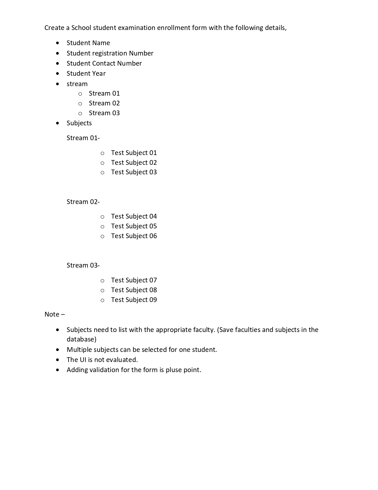

## About

This repository contains an evaluation test document for a project developed with Laravel and Bootstrap. The purpose of this test is to assess the functionality and performance of the project.

## 1. Installation:

Clone this repository to your local machine.
Make sure you have Laravel and Bootstrap installed globally.
Run composer install to install the necessary dependencies.
Create a new database and update the database credentials in the .env file.
Run php artisan migrate to set up the required database tables.

## 2. Usage:

Once the installation is complete, you can start the development server by running php artisan serve.
Open your web browser and access the project at http://localhost:8000.
